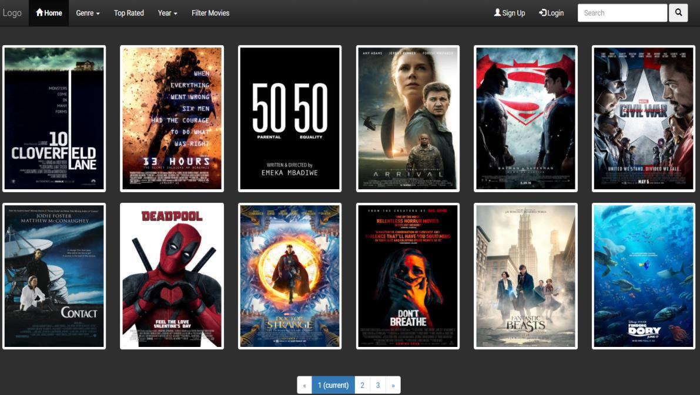
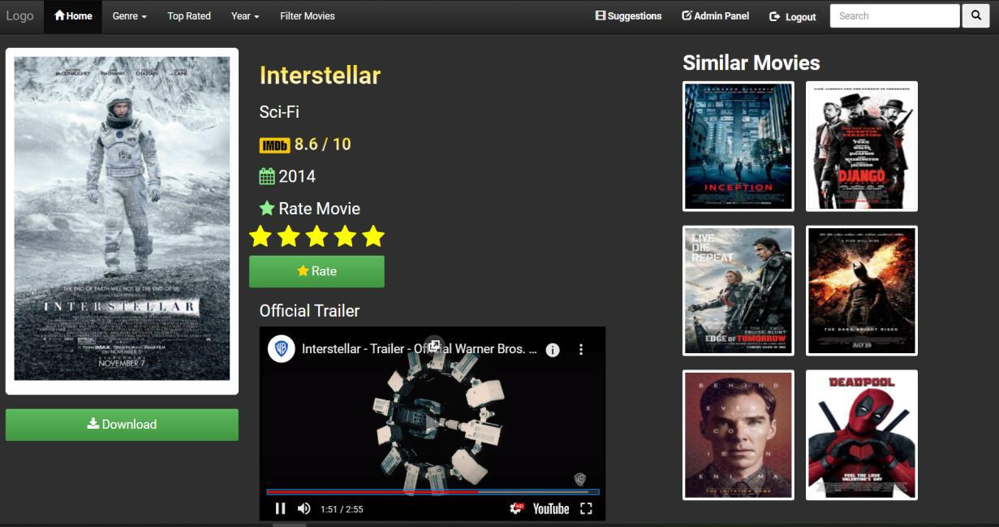
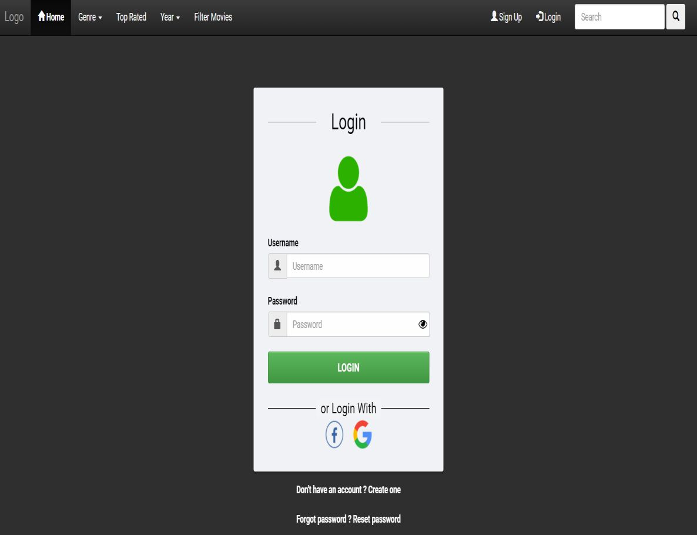
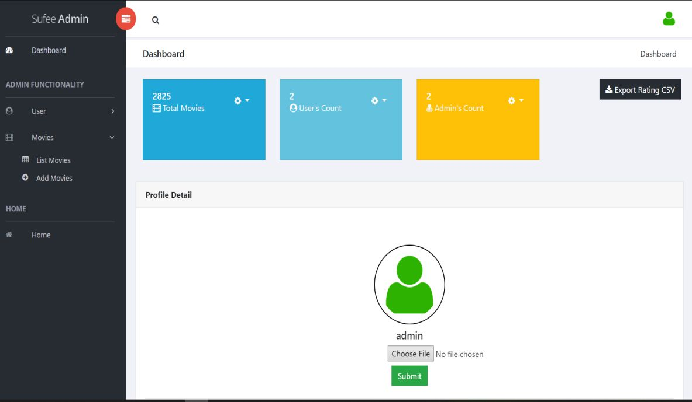
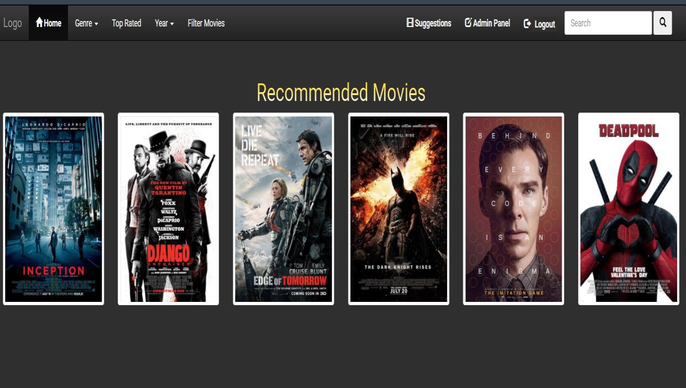
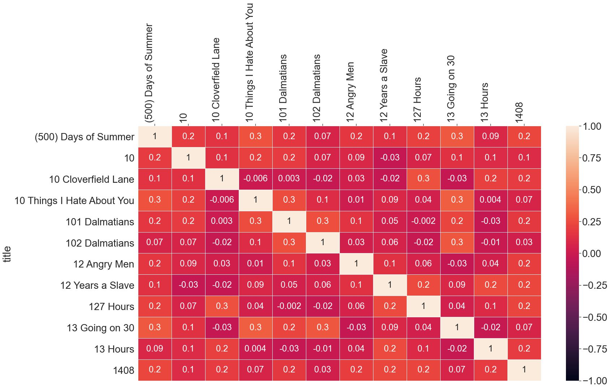

## NextGen Movie Recommender

#### A modern movie discovery platform(site) powered by collaborative filtering with Pearson correlation, delivering personalized recommendations. Trained on large-scale, real-world datasets to ensure highly accurate and dynamic movie suggestions for every user.

#### (Tech stack: Python, Django, JS, GIT, MySQL etc)

#### To run this project Movie_Recommendation:

1) At first, clone the repo.

2) Create python virtual environment as 'movie_env' using following command as:

    a. To create python virtual environment

     --> python -m venv movie_env   (for Windows)

         or
     
     --> python3 -m venv movie_env (for Linux or Mac)

    b. To activate virtual env

     --> movie_env\Scripts\activate     (for windows)

         or
     
     --> source movie_env/bin/activate  (for Linux or Mac)
    

3) Now, install the requirements in the created virtual environment using python command as:

    pip install -r requirements.txt

    [Note: requirements.txt file is inside 'Movie' directory]

4) Create MySQL database with database name as 'Movie' in your localhost or server.

5) Create '.env' file inside 'Movie' directory and write necessary configuration by referencing .env.example file.

6) After that run the setup command as:

    --> python manage.py setup

7) You also need to have 'media' folders which is collection of movie posters or images.

8) You need to first create & kepp a file like, 'item_similarty_df.feather' file inside 'Movie' directory. 
This file is itemsimilarity matrix file which is the output of recommendation algorithm (i.e Pearson correlation)

#### NextGen_Movie_Recommender website successful deployment visuals.

- **Home page**

- **Movie Detail & general Recommendation page**

- **Sign In page**

- **Admin Dashboard**

- **User Specific Recommendations page**

- **Pearson correlation coefficient - Heatmap**

